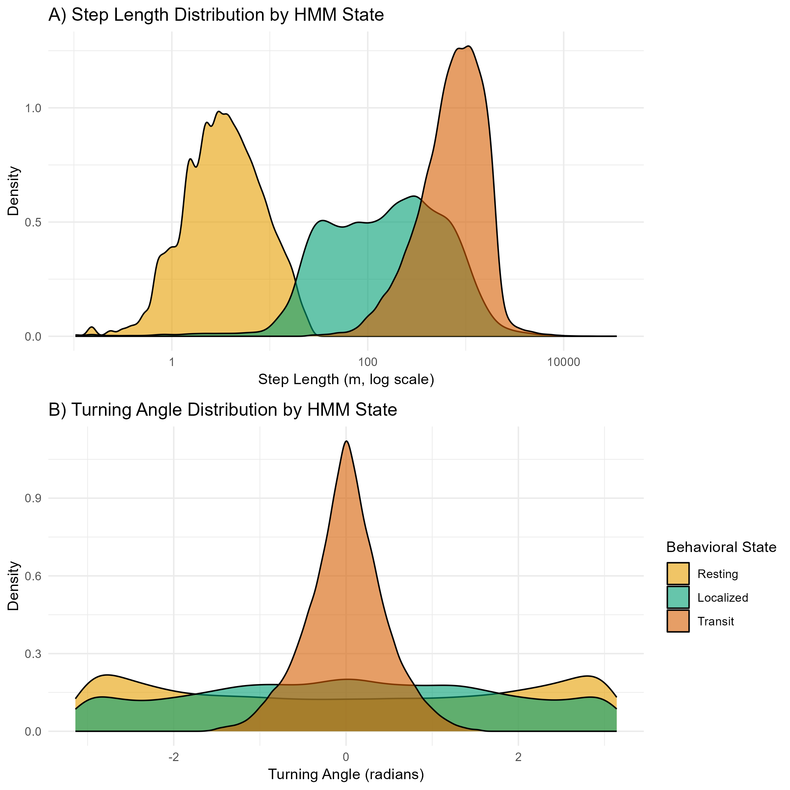
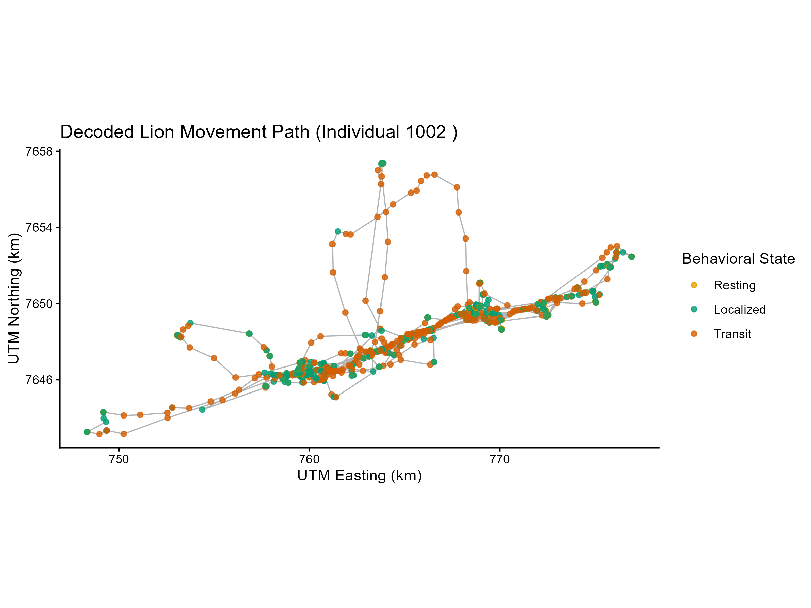
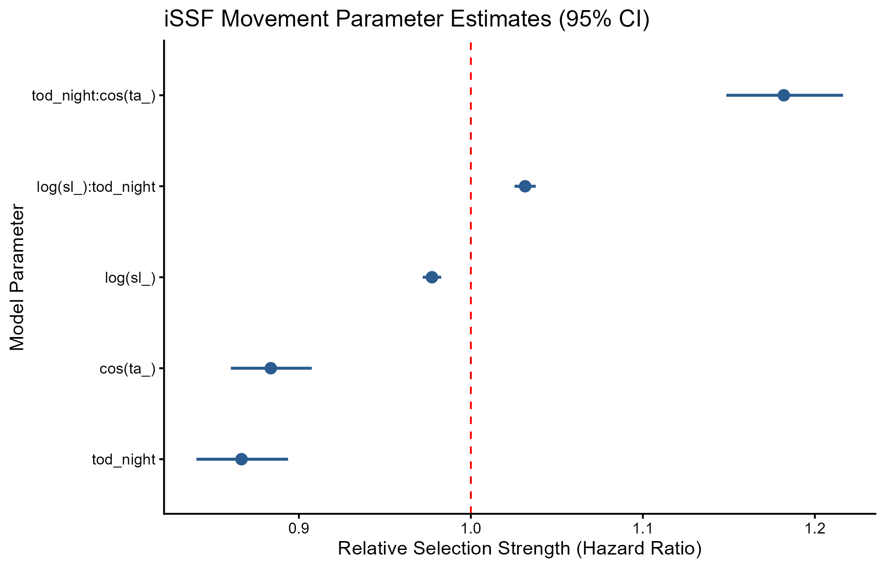

# Kalahari Lion Movement & Behavioral State Analysis

An integrated movement ecology pipeline built in R to decode behavioral states using Hidden Markov Models (HMM) and quantify movement selection using Integrated Step-Selection Functions (iSSF).

## Analysis Pipeline

1. `R/01_data_prep.R` — Cleans raw Movebank GPS telemetry, reprojects coordinates to UTM Zone 34S (meters), resamples tracks to uniform 30-minute intervals, and filters short bursts.
2. `R/02_movement_metrics.R` — Converts regularized tracks into step trajectories, deriving step lengths (`sl_`) and turning angles (`ta_`).
3. `R/03_hmm.R` — Fits a 3-state Hidden Markov Model (`momentuHMM`) to classify behaviors into **Resting**, **Localized Search**, and **Directed Transit** via the Viterbi algorithm.
4. `R/04_issf_analysis.R` — Spawns 10 empirical random steps per observed step (`amt::random_steps`), calculates solar time-of-day, and fits a movement iSSF evaluating day vs. night behavioral shifts.
5. `R/05_publication_figures.R` — Generates publication-ready figures for state distributions, decoded movement paths, and selection parameter hazard ratios.

## Output Figures

## Core R Dependencies

`tidyverse`, `amt`, `momentuHMM`, `sf`, `lubridate`, `grid`
